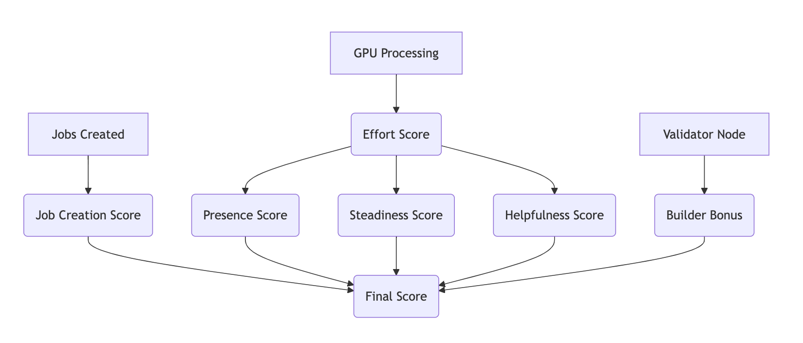

# Republic Testnet Weekly Reward Model & Payout System

A fair, transparent, and anti-gaming reward system for GPU miners and job creators.

Each week, **1,600,000 ecosytem points** is distributed using a **continuous multiplicative scoring model** that rewards:

- Real GPU processing
- Reliable job creation
- Consistent uptime
- Temporal coverage across the week
- Validator participation

This system removes reward cliffs and replaces them with **smooth contribution-based allocation**.

---

# Overview

Traditional tiered mining systems create problems:

| Problem | Effect |
|--------|-------|
| Hard thresholds | 4,999 jobs ≠ 5,000 jobs |
| Burst mining | Short-term optimization instead of stability |
| Job spam | Low-quality submissions |
| Sybil attacks | Wallet splitting advantages |

Republic Testnet replaces tiers with a **continuous contribution function**:
```bash
Final Score = Effort × JobCreation × Presence × Steadiness × Helpfulness × BuilderBonus
```

Your **Final Score** determines your share of the weekly reward pool.

---

# Weekly Reward Pool
```bash
Total Weekly Distribution = 1,600,000 ecosytem points
```

```bash
Maximum Per Wallet = 240,000 ecosytem points (15% cap)
```

Rewards are distributed **proportionally**:
```bash
wallet_reward = (wallet_score / total_network_score) × 1,600,000
```

Then capped at:
```bash
min(wallet_reward, 240,000)
```

---

# Contribution Model Architecture



## Metric Glossary
| Abbrev | Full Meaning |
|-------|--------------|
| Sub | Jobs Submitted: Number of jobs this wallet created |
| CrC | Creation Completed: Number of submitted jobs that reached COMPLETED status |
| EfC | Effort Completed: Jobs processed on GPU with result submitted |
| SR | Success Rate: Completed ÷ Attempted jobs as processor |
| JC | Job Creation Score (ranges from 1.00 to 1.08) |
| Eff | Effort Score (0 if fewer than 5,000 processed jobs) |
| Pres | Presence Score (derived from processed-job active hours only) |
| Steady | Steadiness Score (day spread × streak factor across the week) |
| Help | Helpfulness Score (hour spread × success rate, requires ≥ 5,000 jobs) |
| Build | Builder Bonus (validator uptime proxy + contribution share) |
| Final | Final Contribution Score (used to calculate weekly ecosytem points allocation) |

### The Six Contribution Scores
Each wallet receives six independent scores. These are multiplied together to compute contribution weight
| Score | Formula | Purpose |
|------|---------|---------|
| JC | `1 + min(0.08, completion_rate × 0.08)` | Rewards useful job creation |
| Eff | `sqrt(EfC) × SR` | Measures real GPU contribution |
| Pres | `(unique_active_hours / 168) × SR` | Rewards consistent uptime |
| Steady | `(unique_active_days / 7) x (long_streak_days)` | Rewards weekly activity distribution |
| Help | `1 + (unique_hours_of_day / 24) × 0.25 × SR` | Rewards 24-hour coverage |
| Build | `1 + (uptime_proxy × 0.05) + (contribution_share × 0.05)` | Rewards validator participation |
| Final | `Eff × JC × Pres × Steady × Help × Build` | Determines reward share |
---
## Reward Allocation Algorithm

**Step 1:**
```bash
calculate Final Score for each wallet
```

**Step 2:**
```bash
sum all wallet scores
```

**Step 3:**
```bash
distribute proportional rewards
```

**Step 4:**
```bash
apply 15% wallet cap
```

---
## System Design Principles

The reward system enforces:
| Principle | Mechanism |
|-------|--------------|
| Anti-spam| Job Creation Score |
| Anti-burst mining| Steadiness Score |
| Anti-downtime | Presence Score |
| Anti-timezone gaps|Helpfulness Score |
| Anti-Sybil advantage | Multiplicative scoring|
| Infrastructure incentives| Builder Bonus |

---
## Script Workflow

The payout script:
1. Fetches job data from Yaci Explorer API
2. Caches responses locally
3. Converts wallet ↔ validator addresses automatically
4. Computes all six contribution scores
5. Allocates 1,600,000 ecosystem points proportionally
6. Applies 240,000 cap
7. Outputs payout files

---

## Running the Script

Git clone this repository:
```bash 
https://github.com/geofvn/Republic-gpuminer-rewardcal.git
```

Install dependencies once:
```bash
pip install requests bech32 or pip install requirement.txt
```

Run:
```bash
python3 weekly_payout.py
```

Choose:
```bash
YES → custom interval
NO → last 7 days
```
---
## Important Rules
```bash
1. Only COMPLETED jobs count
2. Effort requires ≥ 5,000 processed jobs
3. Helpfulness requires ≥ 5,000 processed jobs
4. Builder bonus requires bonded validator
5. Maximum payout per wallet = 240,000 ecosystem points
```

---
## Operational Recommendation

Run the payout script weekly:
```bash
Sunday or Monday UTC preferred
```

Ensures consistent reporting windows

---

## Transparency Commitment

This reward model ensures:
- fairness
- predictability
- Sybil resistance
- validator incentives
- global compute availability

Designed for the Republic community 🫂